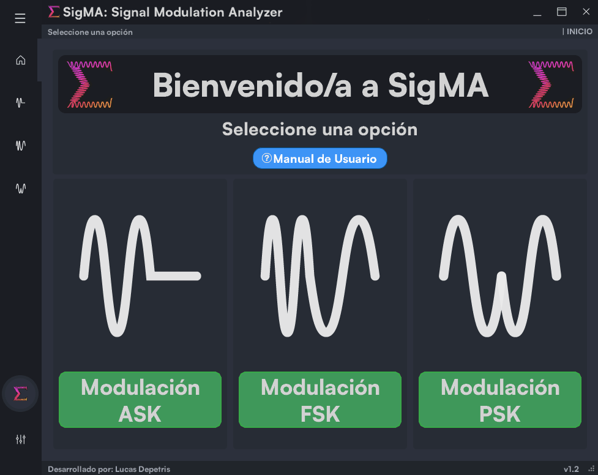
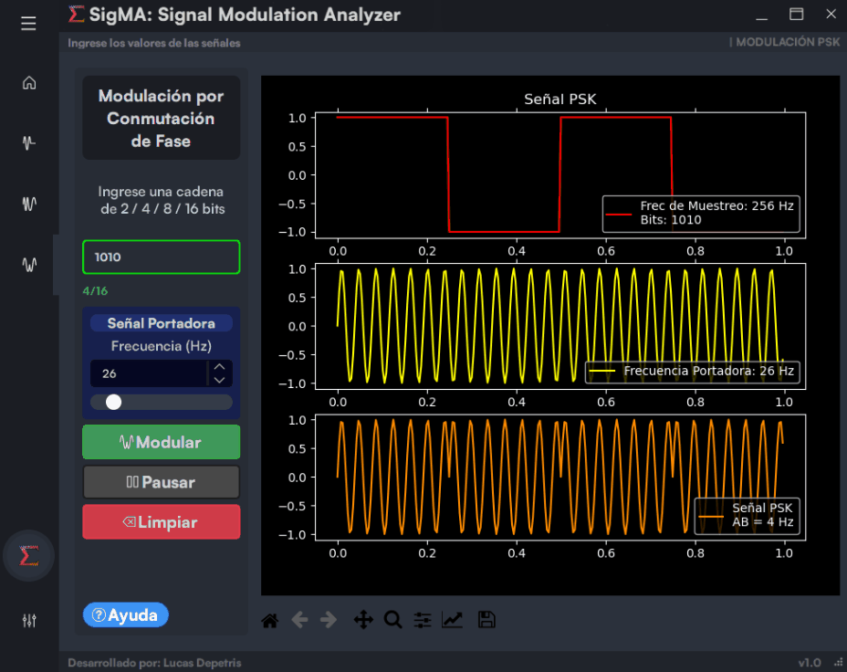
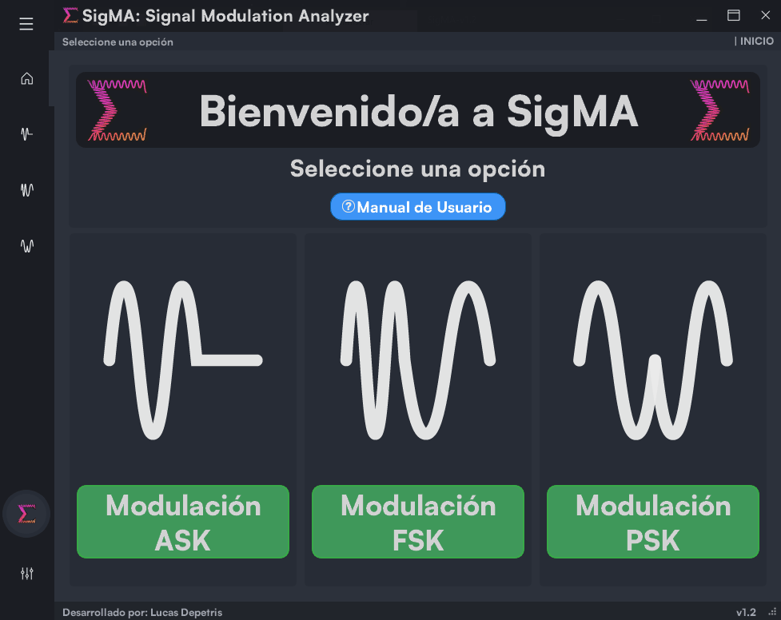

#  SigMA: Signal Modulation Analyzer 

SigMA o Signal Modulation Analyzer es un conjunto de simuladores creados para la materia de Comunicaciones en la UTN-FRT. Este programa ayuda al aprendizaje de diferentes técnicas de modulación (ASK, FSK y PSK).

> SigMA or Signal Modulation Analyzer is a basic kit made for the Communications subject at UTN-FRT that helps in the learning of different modulation techniques (ASK, FSK and PSK).

## ⬇ INSTALACIÓN / INSTALL:
1. [Descargar la última release](https://github.com/lucasdepetrisd/Signal-Modulation-Analyzer/releases/latest).
2. Ejecutar el archivo .exe. En caso que se muestre un mensaje de error de Windows Defender o Windows SmartScreen dirigirse a la sección 1.3 del [manual](https://github.com/lucasdepetrisd/Signal-Modulation-Analyzer/blob/main/Manual_de_Usuario_SigMA.pdf).

(SigMA NO es malware o algun tipo de software malicioso. Marcalo como falsa amenaza en tu antivirus para quitar esta alerta a futuro).

> 1. [Download last release](https://github.com/lucasdepetrisd/Signal-Modulation-Analyzer/releases/latest).
> 2. Execute the downloaded .exe. In case of a Windows Defender or SmartScreen error head to section 1.3 of the [User manual](https://github.com/lucasdepetrisd/Signal-Modulation-Analyzer/blob/main/Manual_de_Usuario_SigMA.pdf) (Spanish).
> 
> (SigMA is NOT a malware or any kind of dangerous software. You can mark it as a non-threat in your antivirus for future removing of this flag).

#  FUNCIONES / FEATURES 
##  Modulaciones ASK, FSK y PSK
> ### Simulation of ASK, FSK and PSK.
<p align="center">
    
<p/>

##  Ajustes de valores máximos y mínimos en la simulación.
> ### Settings menu for max. and min. values.
<p align="center">
    
<p/>

### Ajustes guardados en un archivo compartible.
> ### Settings saving on shareable file.

<p align="center">
    
<p/>

##  Manual de Usuario
> ### Help menu with user manual.
También disponible un [Manual de Usuario](https://github.com/lucasdepetrisd/Signal-Modulation-Analyzer/blob/main/Manual_de_Usuario_SigMA.pdf) en .pdf.
<p align="center">
    
<p/>

Además incluye:
- Animaciones optimizadas.
- Animaciones con anti-aliasing.
- Interfaz gráfica pulida.
- Guardado de configuraciones.
- [Manual de Usuario](https://github.com/lucasdepetrisd/Signal-Modulation-Analyzer/blob/main/Manual_de_Usuario_SigMA.pdf).

> Also includes:
> - Optimized animations. 
> - Anti-aliasing for animations.
> - Polished UI, look and feel.
> - Settings saving.
> - [User Manual](https://github.com/lucasdepetrisd/Signal-Modulation-Analyzer/blob/main/Manual_de_Usuario_SigMA.pdf) (in Spanish).

## PARA DESARROLLO / FOR DEVELOPING:

### ⬇ MODULOS / MODULES:

> ```sh
> pip install pyside2==5.15.2 matplotlib scipy numpy pyqtgraph
> ```
> PySide2 y PyQt5 en la versión 5.15.1 **causan problemas** debido a sus actualizaciones.  
> Utilizar Python 3.9.12 con PySide.  
> 
> > PySide2 and PyQt5 in version 5.15.1 **are causing problems** due to several updates in process.  
> > Use Python 3.9.12 with PySide2. 
> 

### ⚙ EJECUTAR / RUN:
> ```sh
> py main.py
> ```

### TODO:
- Multilenguaje
- Señales moduladas de Fase Continua (CPASK, CPFSK y CPPSK)
